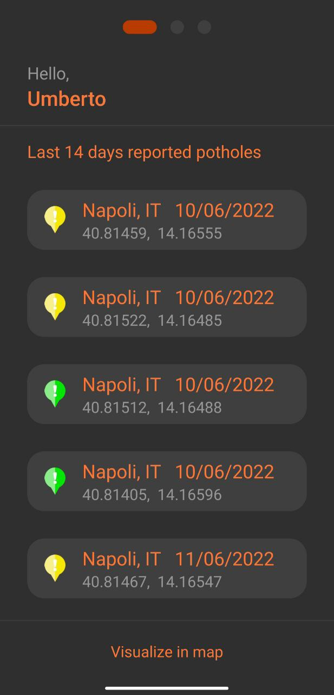

# PotHub
PotHoles tracking Android App developed for Operating Systems class. 
Documentation in Italian, containing implementation details: https://www.dropbox.com/s/t66c7ltydm2wzww/PotHub.rar?dl=0&file_subpath=%2FDocumentazione.pdf

**Notes:** The app was developed during the Operating Systems Computer Science Bachelor's degree course. Its design and implementation was constrained by the examination track. For example, the server had to be implemented in C in order to make practice and familiarize with concepts like thread pools, synchronization mechanisms, TCP/IP stack, sockets, pool() system call, and others..
The simple application protocol designed does not provide any sort of encryption and authentication or authorization mechanisms. SSL sockets could have been used back in the time but I thought that the game was not worth the candle. 
In the future the C server will be replaced by a SpringBoot Web App, providing a more robust and safe backend to the android app.

## Screenshots

### Start a potholes registering session:

### See most recent Potholes reported by signed in user:

### Filter nearby Potholes, specyifing the radius:

### See potholes directly over map:

